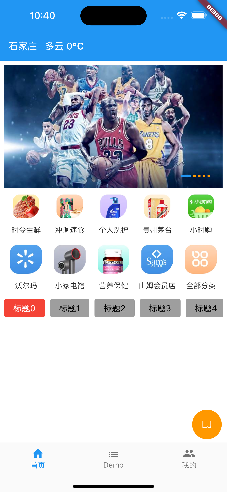
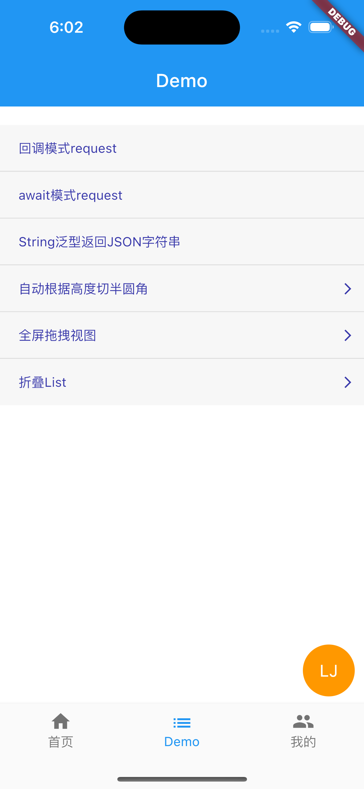
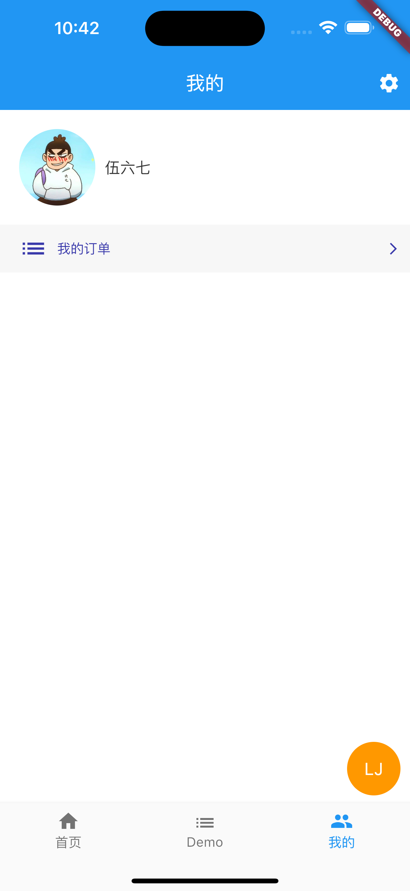
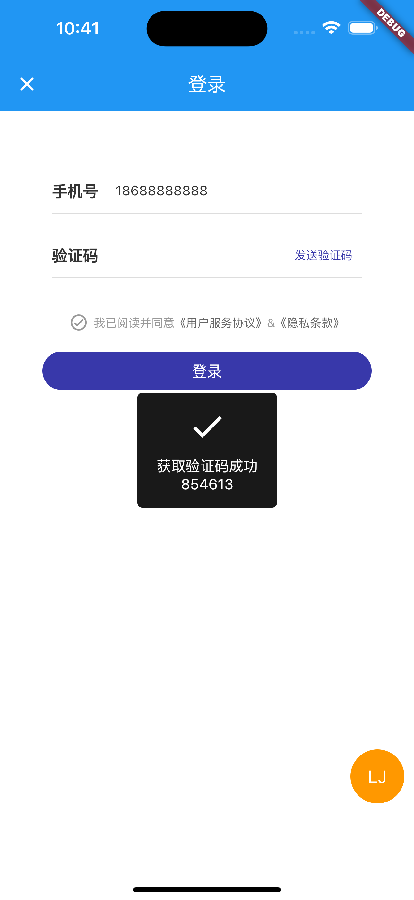
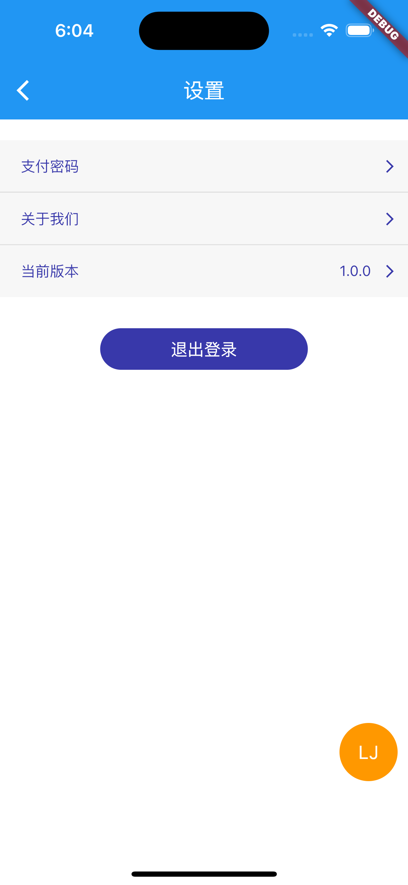
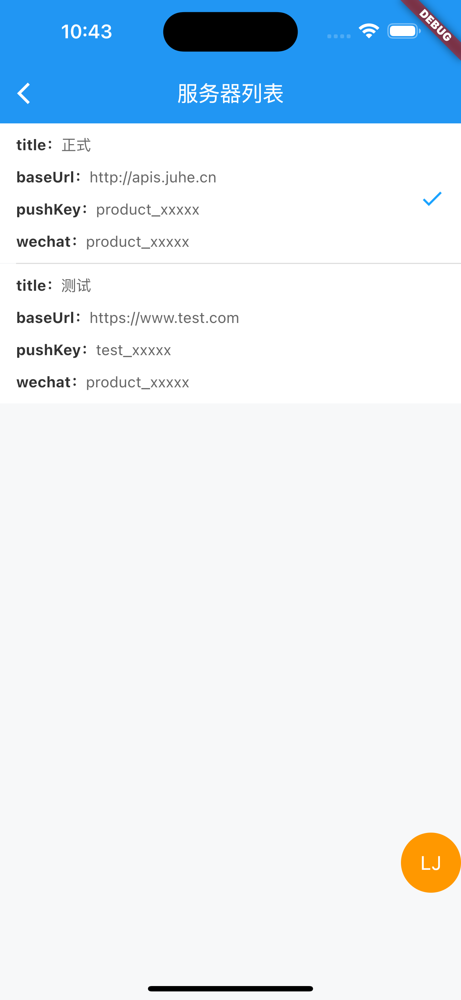
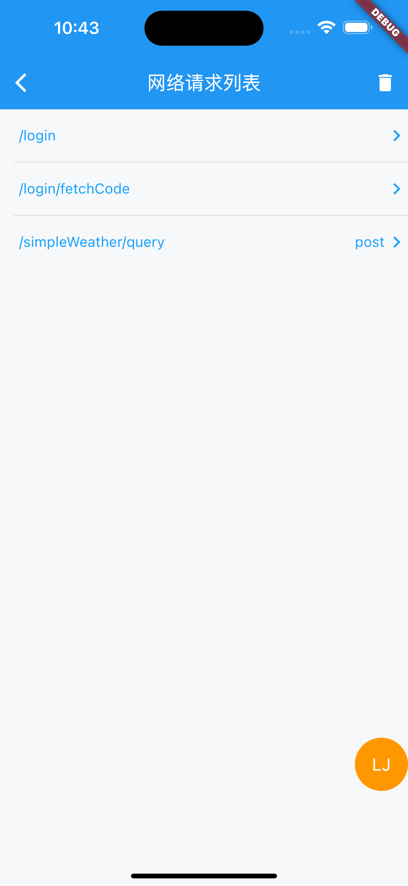
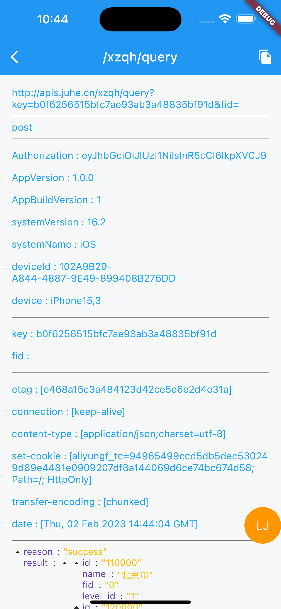
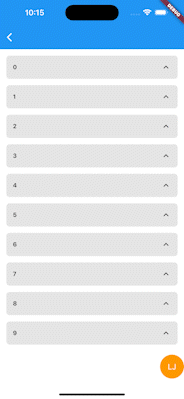

# lj_flutter_package

lj_flutter_package包含网络请求组件(拦截请求、响应、mock)、页面跳转路由管理组件(拦截登录态)、Event Bus等常用函数和类扩展；轮播图、金刚区、官改tabbar(修改官方滑动抖动问题)、验证码button封装、折叠ListView(header悬停)、密码输入框、拖拽widget、网络图片缓存、Webview等常用自定义UI组件。

|  |    |  |
| :--------------------------------: | :---------------------------------: | :-------------------------------: |
|   |      |    |
|  |  |  |

## 添加依赖
```yaml
dependencies:
    lj_flutter_package:
        git: https://github.com/L-Jay/lj_package.git
```

## 网络请求

```dart
// baseUrl配置，https://www.xxx.com
LJNetwork.baseUrl = 'https://www.xxx.com';

// 状态码配置，例如code、errorCode等
LJNetwork.codeKey = 'code';

// 状态码成功值配置，例如0、200等
LJNetwork.successCode = 200;

// 状态码描述配置，例如message、errorMessage等
LJNetwork.messageKey = 'message';

// 默认请求头配置，例如token、version等
LJNetwork.headers.addAll({
  'token': token,
  'version':version,
});

// 统一错误处理回调，例如token过期、服务器错误等
LJNetwork.handleAllFailureCallBack = (error) {
  // 登录过期
  if (error.code == xxx) {
    logout();
  }
};

// json解析回调，接口传入原始值，函数内可使用任何第三方解析库json解析，返回泛型T model类型
LJNetwork.jsonParse = <T>(data) {
  return JsonConvert.fromJsonAsT<T>(data);
};

// 拦截请求参数
 LJNetwork.handleRequestParams =
(String path, Map<String, dynamic>? requestParams) {
      // 全局请求参数处理，比如md5排序加密
      var params = requestParams ?? {};
      params = dosomething(params);
      
      // 指定请求处理
      if (path == '/xxx') {
        params.add({'key1':'value1'});
      }

      return params;
};

// 拦截响应体
LJNetwork.handleResponseData = (String path, Map<String, dynamic> responseData) {
      // 全局处理
      responseData.add({'key1':'value1'});
      
      // 指定请求处理
      if (path == '/xxx') {
        responseData.add({'key2':'value2'});
      }

      return params;
}

// 模拟请求mock
    LJNetwork.mockResponse =
        (String path, Map<String, dynamic>? requestParams) async {
      await Future.delayed(Duration(seconds: 1));

      String jsonStr = '';
      if (path == '/login/fetchCode') {
        int randomCode = Random().nextInt(999999);
        String code = randomCode.toString().padLeft(6, '0');

        jsonStr = '''
        {
    "reason": "获取验证码成功\\n$code",
    "error_code": 0,
    "result": $code
}
''';
      } else if (path == '/login') {
        String phone = requestParams?['phone'];
        String code = requestParams?['code'];

        if (phone == LoginManager.loginPhone &&
            code == LoginManager.loginCode) {
          jsonStr = '''
          {
    "reason": "登录成功",
    "error_code": 0,
    "result": {
        "userId": 5486,
        "avatarUrl": "https://gimg2.baidu.com/image_search/src=http%3A%2F%2Finews.gtimg.com%2Fnewsapp_bt%2F0%2F13236652030%2F1000.jpg&refer=http%3A%2F%2Finews.gtimg.com&app=2002&size=f9999,10000&q=a80&n=0&g=0n&fmt=auto?sec=1661264259&t=702c01270384b8313c1b940ffec3946d",
        "nikeName": "伍六七",
        "token": "eyJhbGciOiJIUzI1NiIsInR5cCI6IkpXVCJ9"
    }
}
''';
        } else {
          jsonStr = '''
          {
    "reason": "验证码错误",
    "error_code": 400
}
''';
        }
      }

      return json.decode(jsonStr);
};

// 回调请求
LJNetwork.post('/xxx',
params: {
    'key1': 'value1',
    'key2': 'value2',
}, successCallback: (data) {
    print(data);
}, failureCallback: (error) {
    print(error);
});

// await请求
T data = await LJNetwork.post<T>('/xxx', params: {
    'id': 'xxx',
});
print(data);
```
## 调试组件

```dart
// 配置环境
LJDebugConfig.configList = [
      {
        'title': '正式',
        'baseUrl': 'http://apis.juhe.cn',
        'pushKey': 'product_xxxxx',
        'wechat': 'product_xxxxx',
      },
      {
        'title': '测试',
        'baseUrl': 'https://www.test.com',
        'pushKey': 'test_xxxxx',
        'wechat': 'product_xxxxx',
      },
];

// 切换环境回调
LJDebugConfig.serviceChangeCallback = (map) async {
      // 切换环境重新登录
      if (LoginManager.isLogin) {
        LoginManager.logout();
      }

      LJNetwork.baseUrl = map['baseUrl'] ?? '';
      //push.key = map['pushKey'];
};
```
## 路由配置

```dart
// 注册路由页面
RouterManager.routes.addAll(LJRouter.routes);

// 获取登录态
RouterManager.getLoginStatus = () {
    return LoginManager.isLogin;
};

// 注册需要登录才可以跳转的页面，跳转前先判断登录态，未登录调用doLogin回调函数
RouterManager.verifyLoginPageList.addAll(LJRouter.verifyLoginPageList);
// 添加需要以fullscreen弹出的页面
RouterManager.fullscreenPageList.addAll(LJRouter.fullscreenPageList);

// 未登录回调函数，例如弹出登录页，返回Future<bool>类型，true表示登录成功，false取消登录
RouterManager.doLogin = (BuildContext context) {
  // 跳转登录页
  return LoginManager.showLogin(context);
};
// 或者指定登录页路由名称
RouterManager.loginPageName = LJRouter.loginPage;

// 全局返回上一页回调函数，可以做页面销毁后的一些操作，例如隐藏加载框
RouterManager.globalPopCallback = () {
  EasyLoading.dismiss();
};

// 跳转页面
RouterManager.pushNamed(context, 
                        pageName,
                        arguments: {'key': value},
                        popCallback: (value) {
                        // 返回上一页回调
                            setState(() {
                                value = value;
                            });
                        }
});

// 获取页面传递参数
void initState() {
    super.initState();
    WidgetsBinding.instance.addPostFrameCallback((timeStamp) {
      // 字典参数获取
      id = argumentMap['id'];
      
      // 单参数获取
      value2 = argument;
      
      // 接口请求
      fetchData(parmas:{'id':id});
    });
}
```

## 工具类

```dart
// App入口
void initState() {
    super.initState();
    
    // 配置app
    _configApp();
  }
  
_configApp() async {
    /*
    preferences = await SharedPreferences.getInstance();
    packageInfo = await PackageInfo.fromPlatform();
    androidDeviceInfo =
        Platform.isIOS ? null : await DeviceInfoPlugin().androidInfo;
    iosDeviceInfo = Platform.isIOS ? await DeviceInfoPlugin().iosInfo : null;
    */
    await LJUtil.initInstance();
    
    hadShow = LJUtil.preferences.getBool(show);
    version = LJUtil.packageInfo.version;
}
```

## 轮播图

```dart
// 轮播图model
List<ImageModel> imageList = [
    ImageModel(
        'https://xxxx',
        'https:www.baidu.com'),
    ImageModel(
        'https://xxxx',
        'https:www.baidu.com'),
];

LJSwiper(
          viewModels: imageList,
          fit: BoxFit.fitWidth,
          getImgUrl: (ImageModel model) {
            return model.imageUrl;
          },
          onTap: (index) {
            Navigator.push(
              context,
              pageRoute(
                  LJWebViewPage(imageList[index].contentUrl),
              ),
            );
          },
        )
```

## 金刚区
```dart
LJTileAreaView(
	count: _tileImages.length,
	crossAxisCount: 5,
	itemHeight: 100,
	imageSize: 60,
	getImageUrl: (index) => _tileImages[index],
	getTitle: (index) => _tileTitles[index],
	clickCallback: (index) {},
)
```
## 图片加载

```dart
// 设置默认占位widget
LJNetworkImage.defaultPlaceholderWidget = Center(
      child: Image.asset(
        Assets.assetsLoading,
        width: 30,
        height: 30,
        fit: BoxFit.scaleDown,
      ),
    );

// 设置默认错误widget
LJNetworkImage.defaultErrorWidget = Container();
    
LJNetworkImage(
    url: url,
    width: 60,
    height: 60,
    radius: 30,
)
```

## 获取验证码按钮

```dart
SendCodeButton(
    controller: _phoneController,
    radius: 15,
    width: 100,
    height: 30,
    fontSize: 14,
    disableColor: garyColor,
    enableColor: blueColor,
    sendCodeMethod: () {
      // 返回Future<bool>，true开始进行倒计时
      return _fetchCode();
    },
)

Future<bool> _fetchCode() async {
    Completer completer = Completer<bool>();
    LJNetwork.post(
      '/fetchCode',
      data: {
        'phone': _phoneController.text,
      },
      successCallback: (data) {
        EasyLoading.showSuccess('获取验证码成功');
        completer.complete(true);
      },
      failureCallback: (error) {
        EasyLoading.showError(error.errorMessage);
        completer.complete(false);
      },
    );

    return completer.future;
}   
```

## 拖拽widget
```dart
// 支持自动吸附边缘
Container(
          width: 300,
          height: 300,
          color: Colors.blueAccent,
          child: Stack(
            children: [
              LJDragContainer(
                adsorption: LJDragAdsorption.all,
                child: quickText('拖我', 15, LJColor.mainColor),
            ),
        ],
    ),
);
```
## 底部Container（全面屏Safe Area）

```dart
// 同时兼容普通屏、全面屏的底部安全区，child为实际显示内容，height为不包含底部安全区的高度，例如iPhone底部的34高度
BottomContainer(
    height: 50,
    color: Colors.white,
    padding: const EdgeInsets.symmetric(horizontal: 15, vertical: 5),
    child: SizedBox(
      width: double.infinity,
      child: TextButton(
        onPressed: () {
          
        },
        style: buttonStyle(
          16,
          Colors.white,
          backgroundColor: blueColor,
        ),
        child: Text('提交'),
      ),
    ),
);
```
## 其他

| 文件 | 描述 |
|------|------|
|   LJRadioTitleBar    |  单选标题栏    |
|   LJDragContainer    |  拖拽widget    |
|   LJPasswordBar    |  密码输入框    |
| LJExpansionWidget           | 折叠ListView，header悬停            |
| LJHalfCornerClipper         | 圆角为高度一半切割                  |
| LJEventBus                  | Event Bus事件队列                   |
| LJPermissionUtils           | 权限管理封装                        |
| lj_custom_ui                | 自定义UI                            |
| lj_extensions               | String扩展、State扩展               |
| LJImageButton               | 自定义Button                        |
| LJGradientLinearProgressBar | 直线进度条                          |
| LJSliverTabBarDelegate      | SliverPersistentHeader delegate封装 |
| LJStarBar                   | 星级条                              |
| TabBarCustom                | 官改tabbar，修复了滑动抖动问题      |
| LJWebViewPage               | WebView Page |

