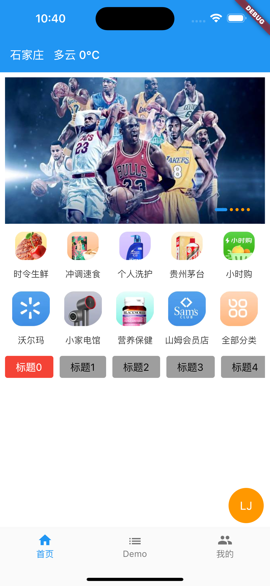
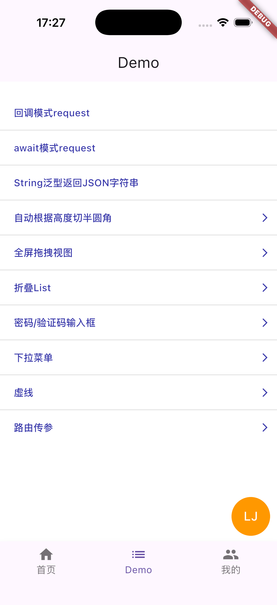
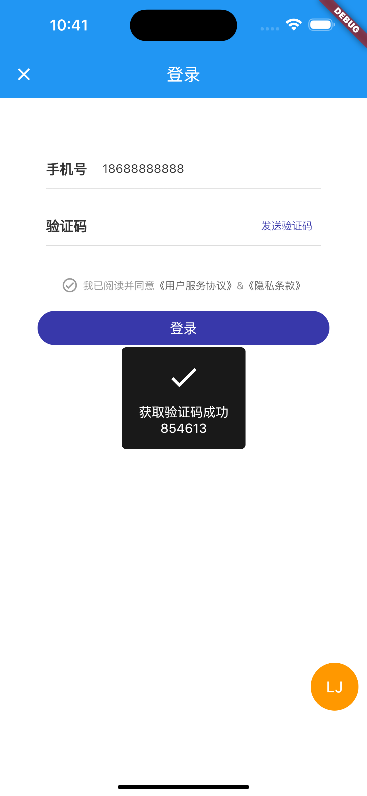
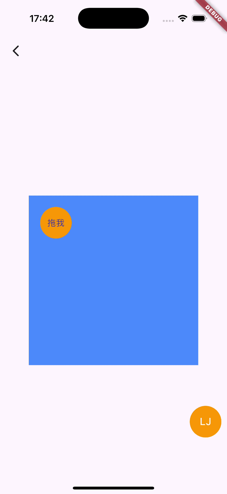
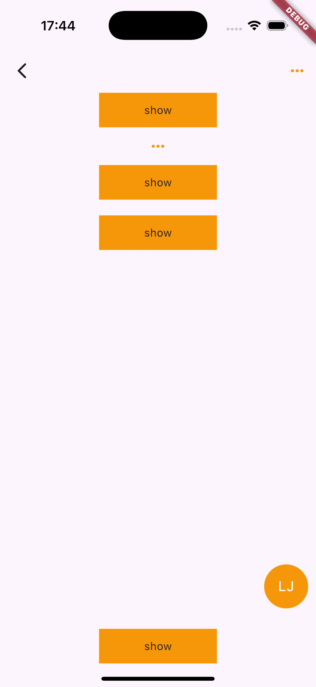
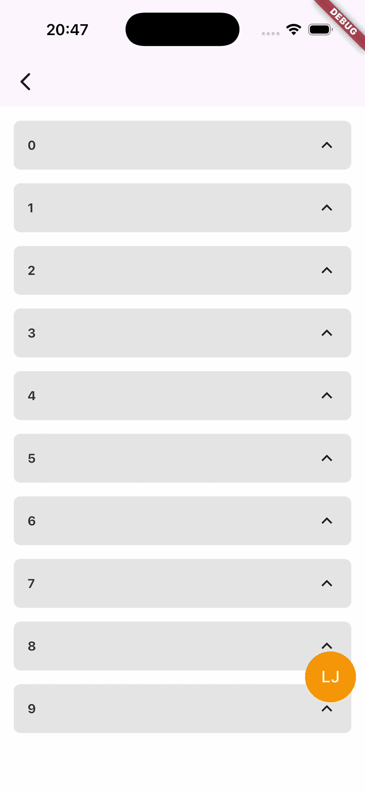
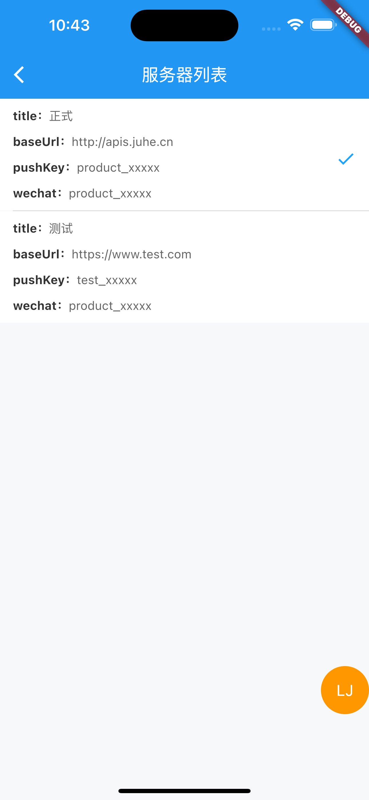
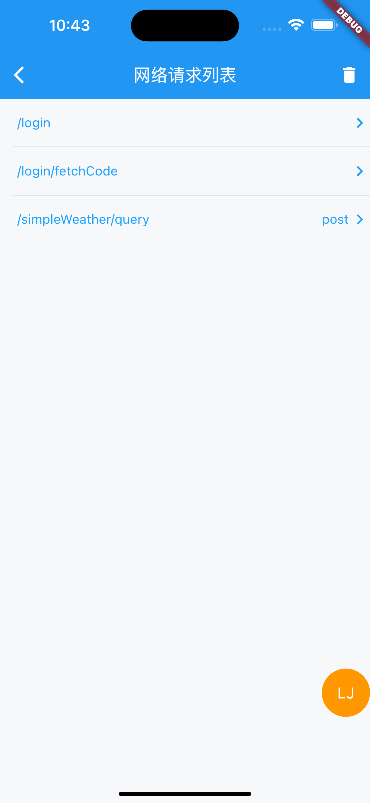
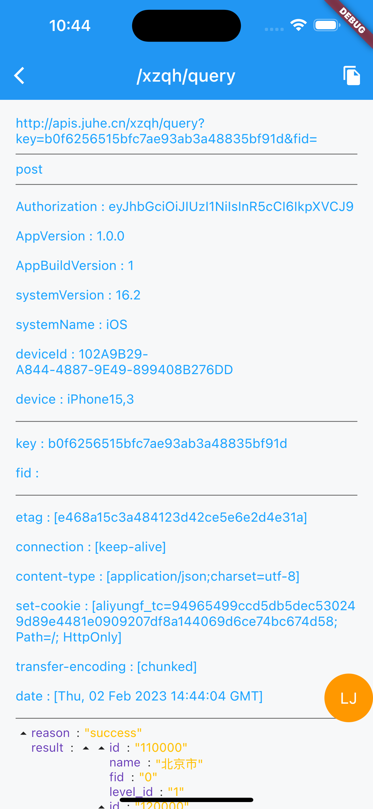

# lj_flutter_package

`lj_flutter_package` 是一个功能完善的 Flutter 基础组件库，提供开箱即用的网络请求、路由管理、Event Bus 等工具类，以及轮播图、金刚区、Button、自定义 TabBar、验证码按钮、折叠列表、密码输入框、拖拽 Widget、网络图片缓存、WebView 等常用 UI 组件。

## ✨ 特性

- 🌐 网络请求：基于 Dio 封装，支持请求/响应拦截、Mock、全局错误处理、网络状态监控
- 🧭 路由管理：支持 GoRouter / Get / Navigator 1.0 三种方案，内置登录态拦截
- 📡 Event Bus：跨组件事件通信，支持持久值存储
- 🛠️ 工具扩展：String 日期转换、手机号验证、State/MediaQuery 快捷访问
- 📝 字体字重：内置 iOS 平台字重补偿，解决 Flutter(iOS) 比原生偏细、与设计稿不一致的问题
- 🎨 UI 组件：轮播图、金刚区、Button、TabBar、验证码、折叠列表、密码框、拖拽、图片缓存、WebView
- 🔧 调试工具：环境切换、网络请求日志查看
- 📱 权限管理：相机、相册、存储、麦克风等封装

## 📸 截图预览

|  |  |  |
| :--------------------: | :--------------------: | :--------------------: |
|  |  |  |
|  |  |  |

## 📦 安装

```yaml
dependencies:
  lj_flutter_package:
    git: https://github.com/L-Jay/lj_flutter_package.git
```

### 初始化

```dart
void main() async {
  WidgetsFlutterBinding.ensureInitialized();
  await LJUtil.initInstance(); // 初始化 SharedPreferences、设备信息等
  runApp(MyApp());
}
```

> 各组件完整用法可参考 `example` 工程，demo 页面位于 `example/lib/demo_pages/`。

## 🌐 网络请求

基于 `dio` 封装，支持请求/响应拦截、Mock、全局错误处理、网络状态监控。

### 基础配置

```dart
LJNetwork.baseUrl = 'https://www.xxx.com';
LJNetwork.codeKey = 'error_code';   // 状态码字段名
LJNetwork.successCode = 0;          // 成功状态码
LJNetwork.messageKey = 'reason';    // 状态描述字段名

// 默认请求头
LJNetwork.headers.addAll({'token': token, 'version': version});

// 默认请求参数（自动拼接到每个请求）
LJNetwork.defaultParams.addAll({'platform': 'flutter'});

// JSON 解析回调（可选，用于自动解析泛型）
LJNetwork.jsonParse = <T>(data) => JsonConvert.fromJsonAsT<T>(data) as T;
```

### 请求 / 响应拦截

```dart
// 拦截请求参数
LJNetwork.handleRequestParams = (String path, Map<String, dynamic>? params) {
  var modified = params ?? {};
  if (path == '/login') {
    modified.addAll({'timestamp': DateTime.now().millisecondsSinceEpoch});
  }
  return modified;
};

// 拦截响应体（仅在请求成功时触发）
LJNetwork.handleResponseData = (String path, Map<String, dynamic> data) {
  data['timestamp'] = DateTime.now().millisecondsSinceEpoch;
  return data;
};
```

### 全局错误处理

```dart
LJNetwork.handleAllFailureCallBack = (LJError error) {
  if (error.errorCode == 401) logout();
  EasyLoading.showError(error.errorMessage);
};
```

### Mock 模拟

```dart
LJNetwork.mockMap['/login/fetchCode'] = (params) {
  String code = Random().nextInt(999999).toString().padLeft(6, '0');
  return jsonEncode({'reason': '成功', 'error_code': 0, 'result': code});
};
```

### 发起请求

```dart
// 回调方式
LJNetwork.post('/xxx', params: {'key': 'value'},
  successCallback: (data) => print(data),
  failureCallback: (error) => print(error),
);

// await 方式（推荐）
final data = await LJNetwork.post<T>('/xxx', params: {'id': '1'});
final list = await LJNetwork.get<T>('/api/list');
await LJNetwork.put('/api/update', params: {...});
await LJNetwork.delete('/api/delete', params: {'id': '1'});
```

### 取消请求 / 网络监控

```dart
LJNetwork.cancel(path: '/api/user/login'); // 取消指定请求
LJNetwork.cancel();                         // 取消所有请求

// 监控网络状态变化
LJNetwork.handleNetworkStatus(() {
  print(LJNetwork.networkActive ? '已连接' : '已断开');
});
bool online = await LJNetwork.networkActiveImmediately;
```

## 🔧 调试组件

内置调试面板，支持多环境切换和网络请求日志查看（仅 Debug 模式生效）。

```dart
// 配置环境（第一个为正式环境，Release 默认使用）
LJDebugConfig.configList = [
  {'title': '正式', 'baseUrl': 'https://api.prod.com', 'pushKey': 'product_key'},
  {'title': '测试', 'baseUrl': 'https://api.test.com', 'pushKey': 'test_key'},
  {'title': '开发', 'baseUrl': 'https://api.dev.com', 'pushKey': 'dev_key'},
];

// 环境切换回调
LJDebugConfig.serviceChangeCallback = (Map<String, String> map) async {
  if (LoginManager.isLogin) LoginManager.logout();
  LJNetwork.baseUrl = map['baseUrl'] ?? '';
};
```

Debug 模式下自动显示悬浮按钮，点击可：

- 🌐 切换服务环境
- 📋 查看网络请求日志（URL、参数、响应）

## 🧭 路由管理

支持三种路由方案，内置登录态拦截。

### 路由方案对比

| 方案               | 适用场景          | 地址栏同步       | 刷新保留参数     | 浏览器前进/后退 |
| ------------------ | ----------------- | ---------------- | ---------------- | --------------- |
| `goRouter`（默认） | Web 首选 / 移动端 | ✅ 完整 URL       | ✅ 从 URL 解析    | ✅ 完全同步      |
| `get`              | 移动端为主        | ✅ 经过处理已支持 | ✅ 经过处理已支持 | ⚠️ 仅回退 URL    |
| `navigator1`       | 纯移动端          | ❌ 不同步         | ❌ 丢失           | ❌ 无效          |

### 配置属性

```dart
// 路由类型，默认 goRouter
RouterManager.routerType = RouterType.goRouter; // goRouter | get | navigator1

// 命名路由表
RouterManager.routes = LJRouter.routes;

// 根页面 / 登录页 / 404 页路由名称
RouterManager.rootPageName = '/';
RouterManager.loginPageName = '/loginPage';
RouterManager.unknownPageName = '/notFoundPage';

// ===== 登录态相关 =====
RouterManager.getLoginStatus = () => LoginManager.isLogin;
// 所有页面都需要登录（优先级最高，适合后台管理）
RouterManager.allPageNeedLogin = false;
// 白名单页面（不需要登录），与 verifyLoginPageList 二选一，哪个有值用哪个
RouterManager.whitePageList = ['/loginPage', '/registerPage'];
// 需要登录才能访问的页面
RouterManager.verifyLoginPageList = ['/orderPage', '/settingPage'];
// 登录回调，返回 true 表示登录成功（优先级高于 loginPageName，适合自定义登录流程）
RouterManager.doLogin = () async => await LoginManager.showLogin();

// ===== 页面样式 =====
RouterManager.fullscreenPageList = ['/loginPage'];     // fullscreen 模态弹出
RouterManager.noAnimationPageList = ['/splashPage'];   // 无过场动画

// ===== 其他 =====
RouterManager.duplicate = false;                       // 是否允许重复弹出相同页面
RouterManager.globalPopCallback = () => EasyLoading.dismiss(); // 全局 pop 回调
```

### 在 MaterialApp 中使用

```dart
// Get
GetMaterialApp(getPages: RouterManager.getPages, ...);
// GoRouter
MaterialApp.router(routerConfig: RouterManager.goRouter, ...);
// Navigator 1.0
MaterialApp(
  navigatorKey: RouterManager.navigatorKey,
  onGenerateRoute: RouterManager.onGenerateRoute,
);
```

### 路由跳转

```dart
RouterManager.pushNamed('/orderPage', arguments: {'id': '123'});
RouterManager.replaceNamed('/homePage');                       // 替换当前页面
final result = await RouterManager.pushNamed<String>('/detail'); // 接收返回值
RouterManager.pushNamed('/detail', arguments: {'id': '1'},
  popCallback: (value) => print('返回: $value'));
RouterManager.pushPage(MyCustomPage());  // 跳转简单页面（无需注册路由）
RouterManager.pop('success');             // 返回上一页
RouterManager.popUntil('/homePage');      // 返回到指定页面
RouterManager.canPop();                   // 当前是否可返回
```

### 获取页面参数

推荐用 `context` 扩展（避免动画转场参数错乱）：

```dart
WidgetsBinding.instance.addPostFrameCallback((_) {
  final id = context.argumentMap?['id'];       // Map 参数
  final name = context.argument;               // Object 参数
  final count = context.argumentForKey<int>('count'); // 指定类型
});
```

> 注意：GoRouter Web 刷新后 `extra` 不会恢复（`RouterManager.argument` / `context.argument` 为 null），Map 参数会从 URL 解析，仍可通过 `argumentMap` 获取。

### 路由状态查询 / 无 Context 跳转

```dart
RouterManager.currentRoute;    // 当前路由名称
RouterManager.routeHistory;    // 路由历史记录
RouterManager.context;         // 全局 context
RouterManager.overlayContext;  // Overlay context

// 通过 navigatorKey 可在任意位置（ViewModel、网络回调）跳转，无需 BuildContext
RouterManager.navigatorKey.currentContext;
```

## 📡 Event Bus

基于流实现的事件总线，用于跨组件通信。

```dart
// 订阅事件（receiveWhenOn=true 会立即收到最后一次 emit 的值）
LJEventBus.on('userLogin', (data) {
  print('用户已登录: $data');
}, receiveWhenOn: true);

// 触发事件
LJEventBus.emit('userLogin', {'userId': 123, 'name': '张三'});

// 取消订阅（在 dispose 中调用）
@override
void dispose() {
  LJEventBus.off('userLogin');
  super.dispose();
}
```

## 🛠️ 工具类

### LJUtil

```dart
await LJUtil.initInstance(); // main 中初始化

LJUtil.preferences.setBool('hasShow', true);
LJUtil.preferences.getBool('hasShow');

LJUtil.packageInfo.version;        // 版本号
LJUtil.packageInfo.buildNumber;    // 构建号
LJUtil.iosDeviceInfo;              // iOS 设备信息
LJUtil.androidDeviceInfo;          // Android 设备信息

// 图片选择（支持裁剪、压缩）
final path = await LJUtil.pickerImage(
  useCamera: true,       // true: 拍照, false: 相册
  userFront: true,       // 前置摄像头
  crop: true,            // 裁剪
  compressQuality: 80,   // 压缩质量 0-100
);
```

### LJPermissionUtils

```dart
await LJPermissionUtils.requestStoragePermission();
await LJPermissionUtils.requestCameraPermission();
await LJPermissionUtils.requestPhotosPermission();
await LJPermissionUtils.requestMicrophonePermission();
```

### 扩展方法

```dart
'13800138000'.verifyPhone();   // 校验手机号
'123'.toInt();                 // String 转 int
'1.5'.toDouble();              // String 转 double
1700000000000.intToDate();     // 时间戳转日期字符串
```

### 通用 Widget 快捷方法

```dart
quickText('Hello', 16, Colors.black);
quickContainer(width: 100, height: 50, color: Colors.blue, circular: 8, child: ...);
buttonStyle(16, Colors.white, backgroundColor: Colors.blue);
showActionSheet(context, ['选项一', '选项二']);
```

## 📝 字体字重（iOS 平台适配）

### 背景

设计稿通常按 iOS 原生（CoreText + SF Pro/PingFang SC）标定字重。实测在 iOS 上，
Flutter 使用自己的渲染引擎（Impeller/Skia，**不走 CoreText**），同样的字重数值会
**整体偏细**（w300~w600 常用区间约细 6~7 个百分点），且非整百字重会被"吸附"到
最近的实体字面。为此包内提供了按平台自适应的字重常量，定义在
`lib/utils/lj_define.dart`。

### 用法

直接使用语义化字重常量，**不要**写 `FontWeight.w500` 这类裸值：

```dart
import 'package:lj_flutter_package/lj_flutter_package.dart';

Text('标题', style: TextStyle(fontSize: 16, fontWeight: medium));
quickText('正文', 14, Colors.black, fontWeight: regular); // 不传默认 regular
```

| 常量          | 设计字重 | iOS 实际取值 | 其他平台 |
| ------------- | -------- | ------------ | -------- |
| `ultralight`  | w100     | w200         | w100     |
| `thin`        | w200     | w300         | w200     |
| `light`       | w300     | w350         | w300     |
| `regular`     | w400     | w450         | w400     |
| `medium`      | w500     | w600         | w500     |
| `semibold`    | w600     | w700         | w600     |
| `bold`        | w700     | w700（不补偿）| w700    |

> 取值经过两版迭代：严格按墨迹密度实测的补偿跨度更大（如原生 w300 ≈ Flutter
> w450、w400 ≈ w600），但视觉走查后采用了当前这组**更保守、更接近原档**的数值。
> 可在 example 工程的「字重」demo 页查看三行对照（Flutter 原始值 / iOS 补偿后 /
> iOS 原生渲染图），并结合自家设计稿走查微调。
>
> 注意：`semibold` 与 `bold` 在 iOS 上实际都落在 w700（bold 未补偿），二者
> 视觉等价；若需要严格的"最粗"层级，可把 `bold` 改为 `FontWeight(900)`。

### 适用范围

- **仅对 iOS 生效**：Android 实测与原生接近，不补偿；
- **不要套用到其他平台**：Windows（Segoe UI/雅黑）、Linux（Cantarell/Noto）系统字体
  不同，补偿值无效；macOS 渲染情况可能与 iOS 类似但未实测，如需支持应另行标定。
  平台判断与取值逻辑均封装在常量内部，业务侧无需关心。

### 注意事项

1. **x50 中间字重不可靠**：PingFang SC 只有 100/200/300/400/500/600 六个实体字面，
   700 以上靠合成粗体。实测吸附关系：
   `w150=w100`、`w250=w200`、`w650=w600`、`w750=w700`、`w850=w800`；
   w350/450/550 也只是略偏向相邻整百，取舍方向不固定。**业务代码不要自行使用 x50
   中间值，只用语义化常量**；上表中 `light→w350`、`regular→w450` 是库内经实测
   有意选取的补偿值（比整百档更接近视觉目标），属于例外。
2. **引用这些常量的 `TextStyle`/`Text` 不能加 `const`**：平台判断是运行时逻辑，
   编译期无法确定值。直接去掉 `const` 即可（性能影响可忽略）；若调用处必须保持
   const，可自行封装一个在 `build` 内部读取字重的 StatelessWidget。
3. **层级注意**：受有效档位限制，高档补偿不保证与设计档一一对应。当前映射中
   `semibold` 与 `bold` 在 iOS 上都渲染为 w700（视觉等价）；如需更粗的强调层级，
   可将 `bold` 调整为 `FontWeight(900)`（实测密度约 0.32，为 Flutter 端最粗档）。

## 轮播图

```dart
// 轮播图 model
List<ImageModel> imageList = [
  ImageModel('https://xxxx', 'https://www.baidu.com'),
  ImageModel('https://xxxx', 'https://www.baidu.com'),
];

LJSwiper(
  viewModels: imageList,
  fit: BoxFit.fitWidth,
  getImgUrl: (ImageModel model) => model.imageUrl,
  onTap: (index) {
    RouterManager.pushPage(LJWebViewPage(imageList[index].contentUrl));
  },
)
```

## 金刚区

```dart
LJTileAreaView(
  count: _tileImages.length,
  crossAxisCount: 5,
  itemHeight: 100,
  imageSize: 60,
  getImageUrl: (index) => _tileImages[index],
  getTitle: (index) => _tileTitles[index],
  clickCallback: (index) {},
)
```

## 图片加载

```dart
// 设置默认占位 widget
LJNetworkImage.defaultPlaceholderWidget = Center(
  child: Image.asset(Assets.assetsLoading, width: 30, height: 30, fit: BoxFit.scaleDown),
);

// 设置默认错误 widget
LJNetworkImage.defaultErrorWidget = Container();

LJNetworkImage(
  url: url,
  width: 60,
  height: 60,
  radius: 30,
)
```

## 官改 TabBar

修复了官方 TabBar 滑动抖动问题。

```dart
TabBarCustom(
  tabs: ['Tab1', 'Tab2', 'Tab3'],
  controller: _tabController,
  indicatorSize: TabBarIndicatorSize.label,
  labelColor: Colors.blue,
  unselectedLabelColor: Colors.grey,
)
```

## 验证码按钮

```dart
SendCodeButton(
  controller: _phoneController,
  radius: 15,
  width: 100,
  height: 30,
  fontSize: 14,
  disableColor: Colors.grey,
  enableColor: Colors.blue,
  // 返回 Future<bool>，true 开始倒计时
  sendCodeMethod: () async {
    final success = await _fetchCode();
    return success;
  },
)

Future<bool> _fetchCode() async {
  try {
    await LJNetwork.post('/fetchCode', params: {
      'phone': _phoneController.text,
    });
    EasyLoading.showSuccess('获取验证码成功');
    return true;
  } catch (e) {
    return false;
  }
}
```

## 拖拽 Widget

```dart
// 支持自动吸附边缘
Container(
  width: 300,
  height: 300,
  color: Colors.blueAccent,
  child: Stack(
    children: [
      LJDragContainer(
        adsorption: LJDragAdsorption.all,
        child: quickText('拖我', 15, LJColor.mainColor),
      ),
    ],
  ),
);
```

## 底部 Container（全面屏 Safe Area）

```dart
// 同时兼容普通屏、全面屏的底部安全区，child 为实际显示内容，height 为不包含底部安全区的高度
BottomContainer(
  height: 50,
  color: Colors.white,
  padding: const EdgeInsets.symmetric(horizontal: 15, vertical: 5),
  child: SizedBox(
    width: double.infinity,
    child: TextButton(
      onPressed: () {},
      style: buttonStyle(16, Colors.white, backgroundColor: blueColor),
      child: Text('提交'),
    ),
  ),
);
```

## 折叠列表 LJExpansionWidget

支持 header 悬停的折叠列表。

```dart
LJExpansionWidget(
  headers: ['分组一', '分组二'],
  itemCount: 10,
  headerBuilder: (ctx, i) => Container(
    height: 40,
    color: Colors.grey[200],
    alignment: Alignment.centerLeft,
    child: Text('分组 ${i + 1}')),
  itemBuilder: (ctx, i) => ListTile(title: Text('Item $i')),
)
```

## 密码输入框 LJPasswordBar

```dart
// Box 样式
LJPasswordBar(
  style: LJPasswordStyle.box,
  length: 6,
  borderColor: Colors.blue,
  borderWidth: 2,
  onChanged: (v) => print('密码: $v'),
)

// Line 样式
LJPasswordBar(style: LJPasswordStyle.line, length: 6)
```

## 下拉刷新列表

```dart
LJRefreshListView(
  controller: _refreshController,
  itemCount: _list.length,
  itemBuilder: (_, i) => ListTile(title: Text(_list[i])),
  onRefresh: () async {
    await _loadData();
    _refreshController.refreshCompleted();
  },
  onLoading: () async {
    await _loadMore();
    _refreshController.loadNoData();
  },
)

// GridView 版本
LJRefreshGridView(
  controller: _refreshController,
  gridDelegate: SliverGridDelegateWithFixedCrossAxisCount(crossAxisCount: 2),
  itemCount: _list.length,
  itemBuilder: (_, i) => Card(child: Center(child: Text(_list[i]))),
)
```

## 图片按钮 LJImageButton

基于 `FilledButton` 封装的图文按钮，支持纯色/渐变背景、按下高亮、选中/禁用状态、图片在四个方向布局等能力。

```dart
// 纯色按钮
LJImageButton(
  text: '提交',
  textStyle: TextStyle(fontSize: 16, color: Colors.white),
  backgroundColor: Colors.blue,
  highlightBackgroundColor: Colors.blue.shade700, // 按下高亮色（不传则自动降低透明度）
  width: 200,
  height: 44,
  borderRadius: 22,
  onPressed: () {},
)

// 渐变按钮（渐变优先级高于纯色）
LJImageButton(
  text: '立即购买',
  textStyle: TextStyle(fontSize: 16, color: Colors.white),
  backgroundGradient: LinearGradient(colors: [Colors.orange, Colors.red]),
  highlightGradient: LinearGradient(colors: [Colors.deepOrange, Colors.red]),
  height: 44,
  borderRadius: 22,
  onPressed: () {},
)

// 图文按钮（图片可位于 左/上/右/下）
LJImageButton(
  text: '微信登录',
  imageName: 'assets/images/icon_wechat.png',
  imageWidth: 24,
  imageHeight: 24,
  position: ButtonImagePosition.left, // left / top / right / bottom
  backgroundColor: Colors.green,
  onPressed: () {},
)

// 可选中按钮
LJImageButton(
  text: '收藏',
  selected: _isCollected,
  backgroundColor: Colors.grey[200],
  selectedBackgroundColor: Colors.red,
  onPressed: () => setState(() => _isCollected = !_isCollected),
)
```

常用属性说明：

| 属性                       | 说明                                                     |
| -------------------------- | -------------------------------------------------------- |
| `backgroundColor`          | 纯色背景，可配 `highlightBackgroundColor` / `selectedBackgroundColor` / `disableBackgroundColor` |
| `backgroundGradient`       | 渐变背景（优先级高于纯色），可配对应 highlight/selected/disable 渐变 |
| `borderSide`               | 边框，禁用时可由 `disableBorderColor` 覆盖               |
| `position` / `align`       | 图片方位（左/上/右/下）与垂直布局时的水平对齐方式        |
| `shrinkWrap`               | 是否紧贴内容（关闭 44x36 最小尺寸与点击热区）            |
| `disableInkWell`           | 是否关闭水波纹，默认关闭                                 |
| `image` / `imageName`      | 自定义图片 Widget 或 asset 名称（禁用时自动叠加灰度滤镜） |


## WebView 页面

```dart
RouterManager.pushNamed('/webview', arguments: 'https://www.example.com');
// 或直接使用
RouterManager.pushPage(LJWebViewPage('https://www.example.com', title: '网页'));
```

## 其他组件

| 组件                        | 描述                                                 |
| --------------------------- | ---------------------------------------------------- |
| LJRadioTitleBar             | 单选标题栏                                           |
| LJDragContainer             | 拖拽 Widget（边缘吸附）                              |
| LJPasswordBar               | 密码输入框（Box/Line 样式）                          |
| LJExpansionWidget           | 折叠 ListView，header 悬停                           |
| LJHalfCornerClipper         | 圆角为高度一半切割                                   |
| LJEventBus                  | Event Bus 事件队列                                   |
| LJPermissionUtils           | 权限管理封装                                         |
| LJCustomClipper             | 自定义圆角切割                                       |
| LJDashedLine                | 虚线组件                                             |
| LJDropdownList              | 下拉菜单                                             |
| LJImageChooseWidget         | 图片选择（拍照/相册/裁剪）                           |
| LJImagePreviewPage          | 图片预览（URL/本地路径）                             |
| LJWrapRadio                 | 流式单选/多选                                        |
| LJRefreshListViewController | 下拉刷新控制器                                       |
| LJCloseBar                  | 可关闭的顶部条                                       |
| LJImageButton               | 图文按钮（纯色/渐变背景，选中/禁用态，图片四向布局） |
| LJGradientLinearProgressBar | 直线进度条                                           |
| LJSliverTabBarDelegate      | SliverPersistentHeader delegate 封装                 |
| LJStarBar                   | 星级条                                               |
| TabBarCustom                | 官改 TabBar，修复了滑动抖动问题                      |
| LJWebViewPage               | WebView Page                                         |
| AvatarWidget                | 头像组件（支持拍照/相册）                            |
| DoublePopWidget             | 双击返回退出                                         |
| KeepAliveWidget             | 保持状态 Widget                                      |
| AlipayUtil / WechatUtil     | 支付宝/微信支付封装                                  |
| LJExtensions                | String/State 扩展方法（文件 lj_extensions.dart）     |
| LJCustomUI                  | 快捷 UI 函数 quickText/quickContainer/buttonStyle 等 |

## 📁 目录结构

````
lib/
├── lj_flutter_package.dart       # 主入口
├── debug/                         # 调试组件（环境切换/网络日志）
├── ui_component/                  # UI 组件
│   ├── lj_swiper.dart             # 轮播图
│   ├── lj_tile_area_view.dart     # 金刚区
│   ├── lj_tabbar.dart             # 官改 TabBar
│   ├── lj_send_code_button.dart   # 验证码按钮
│   ├── lj_expansion_widget.dart   # 折叠列表
│   ├── lj_password_bar.dart       # 密码框
│   ├── lj_drag_container.dart     # 拖拽
│   ├── lj_network_image.dart      # 网络图片
│   ├── lj_webview_page.dart       # WebView
│   ├── lj_bottom_container.dart   # 底部安全区
│   └── lj_refresh_list_view.dart  # 下拉刷新
├── utils/                         # 工具类
│   ├── lj_network.dart            # 网络请求
│   ├── lj_router_manager.dart     # 路由管理
│   ├── lj_event_bus.dart          # Event Bus
│   ├── lj_util.dart               # 工具类
│   ├── lj_permission.dart         # 权限
│   └── lj_extensions.dart         # 扩展方法
└── widgets/                       # Widget 组件
````

## 🤖 AI 协作须知

> 本章节面向基于 `lj_flutter_package` 开发的 AI 编码助手（Claude Code / Cursor / Trae 等）。使用本框架开发时必须遵守以下规则。

### 强制规则

1. **初始化**：`main()` 中必须先调用 `await LJUtil.initInstance()`，否则 `LJUtil.preferences` 等为 null
2. **网络请求**：统一使用 `LJNetwork.post/get/put/delete`，错误已由全局 `LJNetwork.handleAllFailureCallBack` 处理，业务层 `try-catch` 即可，不要重复弹错误提示
3. **路由跳转**：使用 `RouterManager.pushNamed/pop/replaceNamed/popUntil`，**禁止**直接使用 `Navigator.push`
4. **页面参数**：在 `initState` 的 `addPostFrameCallback` 中用 `context.argumentMap` / `context.argument` 获取，三种路由方案均支持；无 context 时可用 `RouterManager.argument` / `RouterManager.argumentMap`（动画转场期间可能参数错乱）；GoRouter 下不要拿全局 `RouterManager.context` 去调 `.argument` 扩展，会报错
5. **资源释放**：StatefulWidget 的 `dispose()` 必须释放 controller、调用 `LJEventBus.off(eventName)` 取消订阅
6. **字体字重**：统一使用 `lib/utils/lj_define.dart` 中的 `ultralight/thin/light/regular/medium/semibold/bold` 常量（iOS 自动补偿，详见上文「字体字重」章节），禁止直接写 `FontWeight.w400` 等裸值，也不要自行使用 x50 中间字重（库内常量已封装补偿值）
7. **禁止事项**：不要在 `build()` 中发起网络请求；不要用 `setState` 模拟数据流，列表分页用 `LJRefreshListViewController`；不要重复造轮子，优先使用框架已有组件

### 标准页面模板

```dart
class MyPage extends StatefulWidget {
  const MyPage({super.key});
  @override
  State<MyPage> createState() => _MyPageState();
}

class _MyPageState extends State<MyPage> {
  List<_Item> _list = [];
  bool _loading = false;

  @override
  void initState() {
    super.initState();
    WidgetsBinding.instance.addPostFrameCallback((_) {
      final id = context.argumentMap?['id'];
      _loadData(id);
    });
  }

  Future<void> _loadData(String? id) async {
    setState(() => _loading = true);
    try {
      final res = await LJNetwork.post<Map<String, dynamic>>(
        '/api/list', params: {'id': id});
      if (mounted && res != null) {
        setState(() => _list = (res['data'] as List?)
            ?.map((e) => _Item.fromJson(e)).toList() ?? []);
      }
    } catch (_) {
      // 错误已由全局回调处理
    } finally {
      if (mounted) setState(() => _loading = false);
    }
  }

  @override
  Widget build(BuildContext context) {
    return Scaffold(
      appBar: AppBar(title: const Text('标题')),
      body: _loading && _list.isEmpty
          ? const Center(child: CircularProgressIndicator())
          : ListView.builder(
              itemCount: _list.length,
              itemBuilder: (_, i) => ListTile(title: Text(_list[i].name))),
    );
  }
}
```

### 组件优先级

| 场景       | 必须使用                                  | 禁止使用                 |
| ---------- | ----------------------------------------- | ------------------------ |
| 轮播图     | `LJSwiper`                                | 自行实现 PageView        |
| 网络图片   | `LJNetworkImage`                          | `Image.network`          |
| 验证码按钮 | `SendCodeButton`                          | 自行实现倒计时           |
| 底部安全区 | `BottomContainer`                         | 手动算 SafeArea          |
| 拖拽悬浮   | `LJDragContainer`                         | 自行实现 GestureDetector |
| 下拉刷新   | `LJRefreshListView` / `LJRefreshGridView` | 第三方 refresh           |
| 路由       | `RouterManager`                           | `Navigator` / `Get.to`   |
| 网络请求   | `LJNetwork`                               | 直接 `dio`               |
| 事件通信   | `LJEventBus`                              | 自行实现 Stream          |
| 字体字重   | `medium` / `regular` 等语义化字重常量     | `FontWeight.w400` 裸值   |

### 命名规范

- 包名/文件名小写下划线：`lj_flutter_package`、`lj_network.dart`（Dart 强制规范，不可改）
- 路由名以 `/` 开头：`/loginPage`、`/orderPage`

> **跨项目使用提示**：本 package 通过 git 引用，新项目如需让 AI 助手基于本框架开发，**直接把本仓库根目录的 `AGENTS.md` 复制到业务项目根目录**即可（`AGENTS.md` 已被 Claude Code / Copilot / Cursor / Windsurf 等主流工具读取）；如需查阅完整 API，可读取 pub 缓存中 `~/.pub-cache/git/lj_flutter_package-*` 目录下的 README.md 与 AGENTS.md（只有业务项目根目录的规则文件会被 AI 工具自动加载，缓存中的供按需查阅）。
